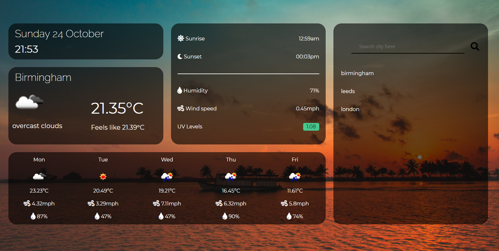
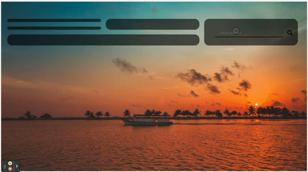

# weather-dashoard

A fully responsive, real-time weather dashboard.

#### You can view the deployed app by [clicking here!](https://fudge88.github.io/weather-dashoard/)



## Summary

This weather app is dynamically created using JQuery, and also runs on Live time. The purpose of this app is to inform the user of the current weather details, and to display the forecast for the following 5 days. This app is made accessible by colour coding the UVI, showing different colours for different levels of alerts. The use of icons and a simple sectioned layout also helps break down the information. The app is fully responsive and collapses the widespread information from a widescreen to a mobile friendly manner.



## User Story

```
AS A traveler
I WANT to see the weather outlook for multiple cities
SO THAT I can plan a trip accordingly
```

## Acceptance Criteria

```
GIVEN a weather dashboard with form inputs
WHEN I search for a city
THEN I am presented with current and future conditions for that city and that city is added to the search history
WHEN I view current weather conditions for that city
THEN I am presented with the city name, the date, an icon representation of weather conditions, the temperature, the humidity, the wind speed, and the UV index
WHEN I view the UV index
THEN I am presented with a color that indicates whether the conditions are favorable, moderate, or severe
WHEN I view future weather conditions for that city
THEN I am presented with a 5-day forecast that displays the date, an icon representation of weather conditions, the temperature, the wind speed, and the humidity
WHEN I click on a city in the search history
THEN I am again presented with current and future conditions for that city
```


## Tools Used:

- Flexbox
- Bulma
- Media queries
- Font awesome
- Google fonts
- Moments JS

#### Languages:

- HTML
- CSS
- JavaScript
- JQuery

#### APIs:

When you use an application on your mobile phone, the application connects to the Internet and sends data to a server. The server then retrieves that data, interprets it, performs the necessary actions and sends it back to your phone. The application then interprets that data and presents you with the information you wanted in a readable way. This is what an API is - all of this happens via API. In this example the API takes the weather APIs response to your request and delivers it right back to the weather dashboard, which then shows you the most updated, relevant information.

### References

[Weather API](https://openweathermap.org/api)

[Bulma](https://bulma.io/documentation/overview/start/)

[Flexbox positioning](https://developer.mozilla.org/en-US/docs/Web/CSS/CSS_Flexible_Box_Layout/Aligning_Items_in_a_Flex_Container)

[Mozilla.org](https://developer.mozilla.org/en-US/docs/)

[StackOverflow](https://stackoverflow.com/questions/)

[unsplash image](https://unsplash.com/s/photos/skyline?utm_source=unsplash&utm_medium=referral&utm_content=creditCopyText)


## License

This project is licensed under the terms of the MIT license.
